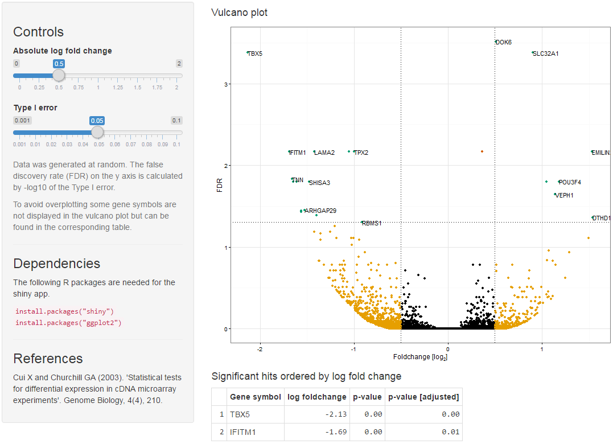

# Visualisation of the vulcano plot

This is an example application for Shiny.



## Dependencies
The following R packages are needed for the Shiny app:

```R
install.packages("shiny")
install.packages("ggplot2")
```

## Installation

```R
library(shiny)

runGitHub("vulcano", "jkruppa")
```
